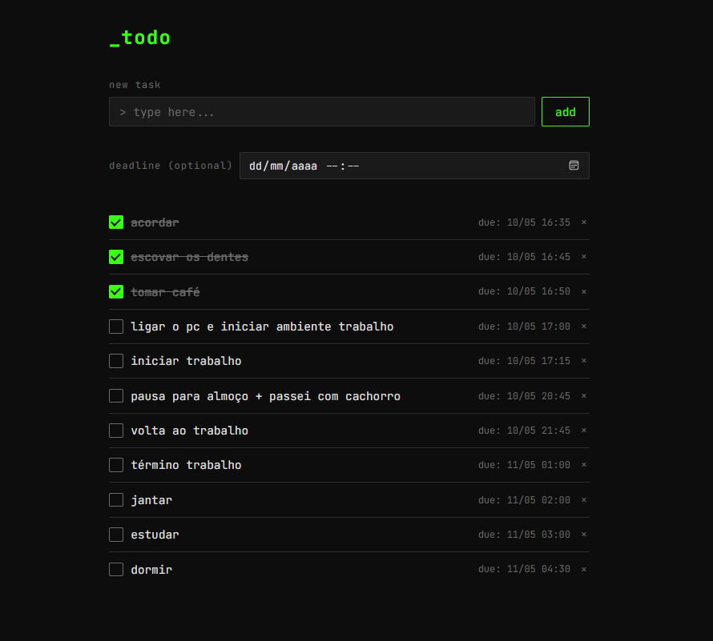
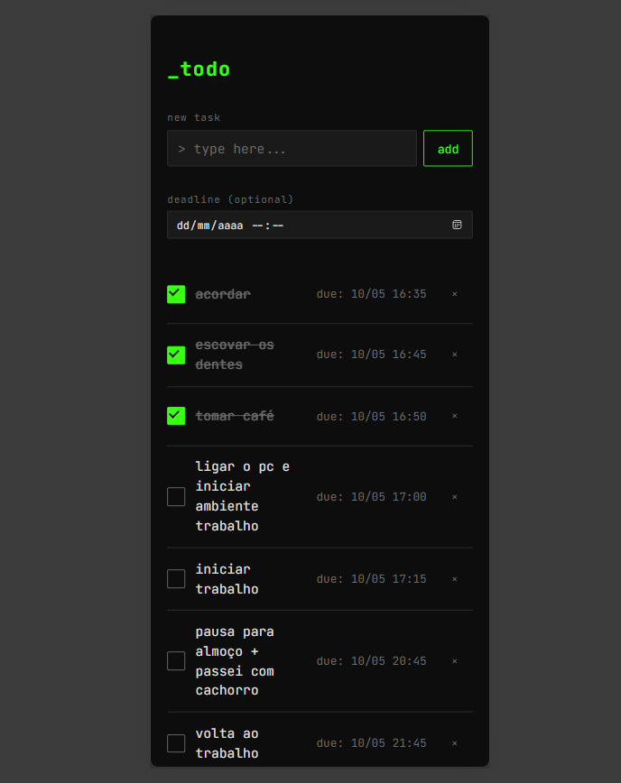
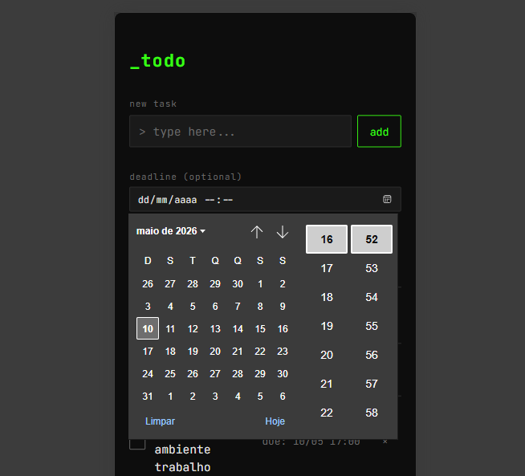
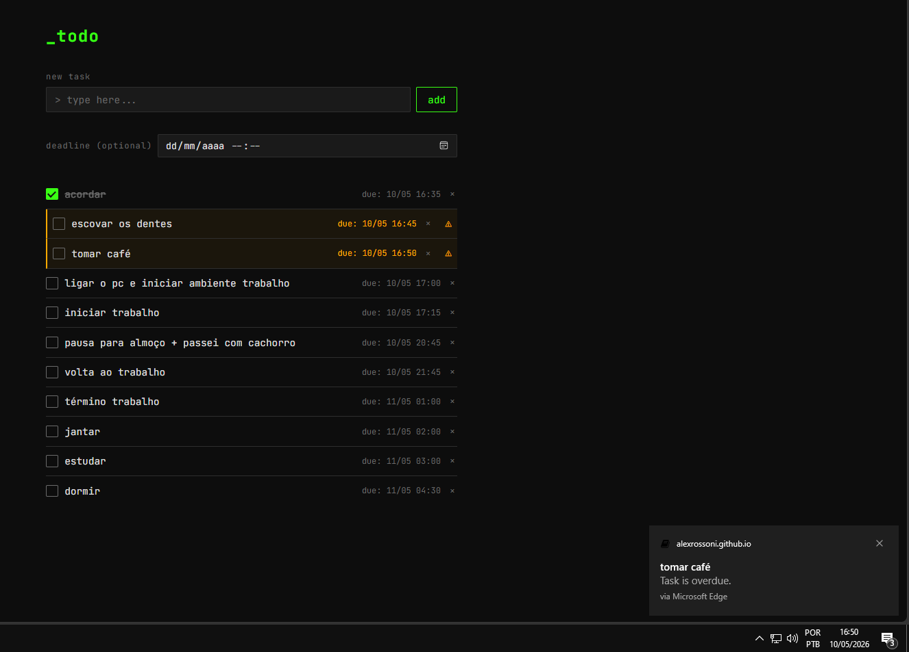
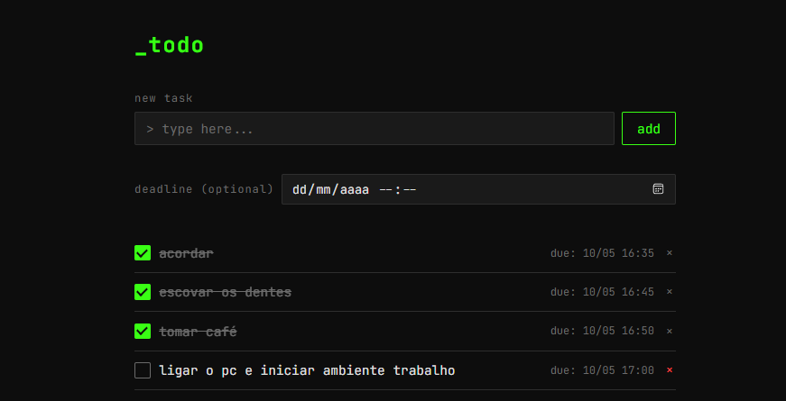

# sdd-to-do-list

To-Do List simples desenvolvida com HTML, CSS e JavaScript vanilla, como exercício prático de **Spec-Driven Development (SDD)**.

## Links

| | |
|---|---|
| **Aplicação** | https://alexrossoni.github.io/sdd-to-do-list/ |
| **Documentação** | https://alexrossoni.github.io/sdd-to-do-list/docs/ |

---

## Preview

<p align="center">
  
</p>

<p align="center">
  
  &nbsp;&nbsp;&nbsp;
  
</p>

---

## Funcionalidades em destaque

### Notificações do navegador

Quando o usuário concede permissão, o app dispara notificações nativas do sistema operacional ao detectar tarefas vencidas.

<p align="center">
  
</p>

### Remoção de tarefas

Cada tarefa exibe um botão **×** para exclusão rápida diretamente na lista.

<p align="center">
  
</p>

---

## Estrutura do projeto

```
sdd-to-do-list/
├── index.html          # Estrutura da página
├── style.css           # Estilos visuais
├── js/
│   ├── controller.js   # Lógica de controle (MVC)
│   ├── model.js        # Modelo de dados
│   └── view.js         # Renderização e DOM
├── assets/
│   └── screenshots/    # Capturas de tela do projeto
├── docs/               # Documentação MkDocs
└── specs/              # Especificações SDD por feature
```

## Tecnologias

- HTML5
- CSS3
- JavaScript (ES6+)

## Como executar
Use um servidor local (ex: Live Server no VS Code) e acesse via `http://localhost:5500`.

